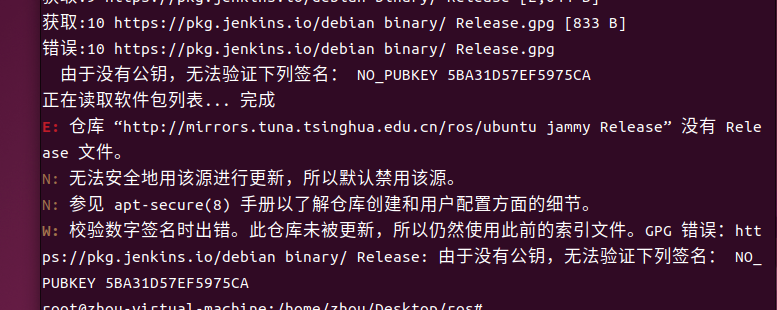
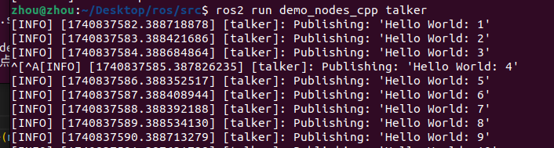

# Day 01

​       自己参考博客搭建ros1系统，存在一堆问题无法解决， i一直存在报错，**参考多篇csdn 配置秘钥无果**。



查阅大量资料发现，**一直使用的是Ubuntu 22.04, 不支持ROS1**。后尝试用docker部署，找到的ROS镜像需要跑GPU， 使用vm ware不存在GPU， 处理起来较为繁琐，遂放弃。

进一步发现ROS2正在逐步淘汰ROS1, 只有老项目和部分ROS1独有包未迁移到ROS2项目仍在使用ROS1，遂放弃，**直接开始ROS2学习。**

## 环境安装【可直接食用】

1. 视频参考B站，【古月居】

    https://www.bilibili.com/video/BV16B4y1Q7jQ?spm_id_from=333.788.videopod.episodes&vd_source=3d6e4ea4a5999a0c787ceee053c46a1d&p=3

2. 视频配套文档

   https://book.guyuehome.com/ROS2/1.%E7%B3%BB%E7%BB%9F%E6%9E%B6%E6%9E%84/1.3_ROS2%E5%AE%89%E8%A3%85%E6%96%B9%E6%B3%95/#2_1

直接使用之前的干净的Ubunu 22.04从零开始搭建ROS2 humble环境，完美搭建成功,成功复现hello world。




## 需要记录点

1. rosdepc

   我们从社区中下载的各种代码，多少都会有一些依赖，我们可以手动一个一个安装，也可以使用rosdep工具自动安装。

   rosdep不方便国内访问，所以一共rosdepc供国内下载。

   ```shell
   sudo apt install -y python3-pip
   sudo pip3 install rosdepc
   sudo rosdepc init
   rosdepc update
   rosdepc install -i --from-path src --rosdistro humble -y
   ```

   

2. 如何编译

   通过colcon 进行编译

   ```
    colcon build
   ```

