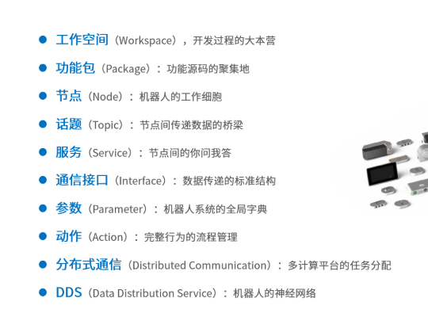

[TOC]

# 初识ROS 2

   按古月居的分类，ROS核心框架分为，详细参考[古月居-文档博客](https://book.guyuehome.com/ROS2/2.%E6%A0%B8%E5%BF%83%E6%A6%82%E5%BF%B5/2_%E6%A6%82%E5%BF%B5%E6%80%BB%E8%A7%88/)，虽然博客里面都有，但是手动敲一遍文档，印象会更深一点。




## 工作空间

开始觉得工作空间也算核心框架？

后面查阅了部分资料参考 [知乎-ROS的目录文件结果](https://zhuanlan.zhihu.com/p/139405796), 发现 如何规范空间也确实存在意义.

工作空间也就是管理和组织ROS工程项目文件的地方。其下主要的一级目录有四个：

- src：源空间
- build：编译空间
- devel：开发空间
- install：安装空间


## 包管理

1. 创建功能包

   ```shell
   $ ros2 pkg create --build-type ament_cmake learning_pkg_c               # C++
   $ ros2 pkg create --build-type ament_python learning_pkg_python 		# Python
   ```

   

2. 编译功能包

   ```shell
   colcon build   # 编译工作空间所有功能包
   source install/local_setup.bash
   ```

   

3.  C++功能包

   - **package.xml**

     package.xml文件的主要内容如下，包含功能包的版权描述，和各种依赖的声明。

   - **CMakerLists.txt**。

4. python功能包

   - **package.xml**
   - **setup.py**


## 节点

### 1.基本概念

​	节点可以理解成ROS的最小单元，可以独立工作,  后续的发布/订阅/服务端/客户端， 都是在节点的基础上进行增加消息的收发处理逻辑。

### 2. 参考代码

参考古月居的节点hello world代码，主要展示了一个ROS基本程序是如何运行的

rclpy.init -> create node -> ros.spin加载node -> node desory -> rclpy deini。

```Python
#!/usr/bin/env python3
# -*- coding: utf-8 -*-

"""
@作者: 古月居(www.guyuehome.com)
@说明: ROS2节点示例-发布“Hello World”日志信息, 使用面向对象的实现方式
"""

import rclpy                                     # ROS2 Python接口库
from rclpy.node import Node                      # ROS2 节点类
import time

"""
创建一个HelloWorld节点, 初始化时输出“hello world”日志
"""
class HelloWorldNode(Node):
    def __init__(self, name):
        super().__init__(name)                     # ROS2节点父类初始化
        while rclpy.ok():                          # ROS2系统是否正常运行
            self.get_logger().info("Hello World")  # ROS2日志输出
            time.sleep(0.5)                        # 休眠控制循环时间

def main(args=None):                               # ROS2节点主入口main函数
    rclpy.init(args=args)                          # ROS2 Python接口初始化
    node = HelloWorldNode("node_helloworld_class") # 创建ROS2节点对象并进行初始化
    rclpy.spin(node)                               # 循环等待ROS2退出
    node.destroy_node()                            # 销毁节点对象
    rclpy.shutdown()                               # 关闭ROS2 Python接口
```


## TOPIC 发布/订阅模型

### 1. 基本概念及实现

 ROS中支持发布/订阅模型，

- 发布者

   继承基类Node ， 通过实现 `create_publisher` 创建一个发布者类，定义推送消息类型 和定义主题

    可以通过实现`create_timer`， 实现时间回调函数，定期推送数据。

- 订阅者

  继承基类Node， 通过实现`create_subscription`  创建一个订阅者类，定义接受的消息类型和定义的主题。

  实现`listener_callback`, 对收到的信息进行处理。


### 2. 查询命令

```shell
ros2 topic list                # 查看话题列表
ros2 topic info <topic_name>   # 查看话题信息
ros2 topic hz <topic_name>     # 查看话题发布频率
ros2 topic bw <topic_name>     # 查看话题传输带宽
ros2 topic echo <topic_name>   # 查看话题数据
ros2 topic pub <topic_name> <msg_type> <msg_data>   # 发布话题消息
```


### 3. 参考代码

1. 参考发布者模型

```python
#!/usr/bin/env python3
# -*- coding: utf-8 -*-

"""
@作者: 古月居(www.guyuehome.com)
@说明: ROS2话题示例-发布“Hello World”话题
"""

import rclpy                                     # ROS2 Python接口库
from rclpy.node import Node                      # ROS2 节点类
from std_msgs.msg import String                  # 字符串消息类型

"""
创建一个发布者节点
"""
class PublisherNode(Node):

    def __init__(self, name):
        super().__init__(name)                                    # ROS2节点父类初始化
        self.pub = self.create_publisher(String, "chatter", 10)   # 创建发布者对象（消息类型、话题名、队列长度）
        self.timer = self.create_timer(0.5, self.timer_callback)  # 创建一个定时器（单位为秒的周期，定时执行的回调函数）

    def timer_callback(self):                                     # 创建定时器周期执行的回调函数
        msg = String()                                            # 创建一个String类型的消息对象
        msg.data = 'Hello World'                                  # 填充消息对象中的消息数据
        self.pub.publish(msg)                                     # 发布话题消息
        self.get_logger().info('Publishing: "%s"' % msg.data)     # 输出日志信息，提示已经完成话题发布

def main(args=None):                                 # ROS2节点主入口main函数
    rclpy.init(args=args)                            # ROS2 Python接口初始化
    node = PublisherNode("topic_helloworld_pub")     # 创建ROS2节点对象并进行初始化
    rclpy.spin(node)                                 # 循环等待ROS2退出
    node.destroy_node()                              # 销毁节点对象
    rclpy.shutdown()                                 # 关闭ROS2 Python接口
```


2. 参考订阅者模型

```python
#!/usr/bin/env python3
# -*- coding: utf-8 -*-

"""
@作者: 古月居(www.guyuehome.com)
@说明: ROS2话题示例-订阅“Hello World”话题消息
"""

import rclpy                      # ROS2 Python接口库
from rclpy.node   import Node     # ROS2 节点类
from std_msgs.msg import String   # ROS2标准定义的String消息

"""
创建一个订阅者节点
"""
class SubscriberNode(Node):

    def __init__(self, name):
        super().__init__(name)                             # ROS2节点父类初始化
        self.sub = self.create_subscription(\
            String, "chatter", self.listener_callback, 10) # 创建订阅者对象（消息类型、话题名、订阅者回调函数、队列长度）

    def listener_callback(self, msg):                      # 创建回调函数，执行收到话题消息后对数据的处理
        self.get_logger().info('I heard: "%s"' % msg.data) # 输出日志信息，提示订阅收到的话题消息

def main(args=None):                               # ROS2节点主入口main函数
    rclpy.init(args=args)                          # ROS2 Python接口初始化
    node = SubscriberNode("topic_helloworld_sub")  # 创建ROS2节点对象并进行初始化
    rclpy.spin(node)                               # 循环等待ROS2退出
    node.destroy_node()                            # 销毁节点对象
    rclpy.shutdown()                               # 关闭ROS2 Python接口
```


## 服务器/客户端 模型

### 1. 基础概念及实现

 ROS中同时支持服务器/客户端模型，

- 服务器模型

  - 创建服务器

   继承基类Node ， 通过实现 `create_service` 创建一个服务器类，定义消息类型 和服务器名称

  - 监听

    可以通过实现`adder_callback`， 处理来自客户端的请求 及返回回应。

- 客户端

  - 创建客户端

    继承基类Node， 通过实现`create_client`  创建一个客户端，定义接受的消息类型和连接服务器。

  - 连接服务器

    通过`wait_for_service`, 判断是否连接成功

  - 发生消息

    通过`call_async` 发送同步消息

### 2. 查询命令

```
ros2 service list                  # 查看服务列表
ros2 service type <service_name>   # 查看服务数据类型
ros2 service call <service_name> <service_type> <service_data>   # 发送服务请求
```

### 3. 参考代码

1. 服务器

   ```python
   #!/usr/bin/env python3
   # -*- coding: utf-8 -*-
   
   """
   @作者: 古月居(www.guyuehome.com)
   @说明: ROS2服务示例-提供加法器的服务器处理功能
   """
   
   import rclpy                                     # ROS2 Python接口库
   from rclpy.node   import Node                    # ROS2 节点类
   from learning_interface.srv import AddTwoInts    # 自定义的服务接口
   
   class adderServer(Node):
       def __init__(self, name):
           super().__init__(name)                                                           # ROS2节点父类初始化
           self.srv = self.create_service(AddTwoInts, 'add_two_ints', self.adder_callback)  # 创建服务器对象（接口类型、服务名、服务器回调函数）
   
       def adder_callback(self, request, response):   # 创建回调函数，执行收到请求后对数据的处理
           response.sum = request.a + request.b       # 完成加法求和计算，将结果放到反馈的数据中
           self.get_logger().info('Incoming request\na: %d b: %d' % (request.a, request.b))   # 输出日志信息，提示已经完成加法求和计算
           return response                          # 反馈应答信息
   
   def main(args=None):                             # ROS2节点主入口main函数
       rclpy.init(args=args)                        # ROS2 Python接口初始化
       node = adderServer("service_adder_server")   # 创建ROS2节点对象并进行初始化
       rclpy.spin(node)                             # 循环等待ROS2退出
       node.destroy_node()                          # 销毁节点对象
       rclpy.shutdown()                             # 关闭ROS2 Python接口
   ```

   

2. 客户端

```python
#!/usr/bin/env python3
# -*- coding: utf-8 -*-

"""
@作者: 古月居(www.guyuehome.com)
@说明: ROS2服务示例-发送两个加数，请求加法器计算
"""

import sys

import rclpy                                  # ROS2 Python接口库
from rclpy.node   import Node                 # ROS2 节点类
from learning_interface.srv import AddTwoInts # 自定义的服务接口

class adderClient(Node):
    def __init__(self, name):
        super().__init__(name)                                       # ROS2节点父类初始化
        self.client = self.create_client(AddTwoInts, 'add_two_ints') # 创建服务客户端对象（服务接口类型，服务名）
        while not self.client.wait_for_service(timeout_sec=1.0):     # 循环等待服务器端成功启动
            self.get_logger().info('service not available, waiting again...') 
        self.request = AddTwoInts.Request()                          # 创建服务请求的数据对象

    def send_request(self):                                          # 创建一个发送服务请求的函数
        self.request.a = int(sys.argv[1])
        self.request.b = int(sys.argv[2])
        self.future = self.client.call_async(self.request)           # 异步方式发送服务请求

def main(args=None):
    rclpy.init(args=args)                        # ROS2 Python接口初始化
    node = adderClient("service_adder_client")   # 创建ROS2节点对象并进行初始化
    node.send_request()                          # 发送服务请求

    while rclpy.ok():                            # ROS2系统正常运行
        rclpy.spin_once(node)                    # 循环执行一次节点

        if node.future.done():                   # 数据是否处理完成
            try:
                response = node.future.result()  # 接收服务器端的反馈数据
            except Exception as e:
                node.get_logger().info(
                    'Service call failed %r' % (e,))
            else:
                node.get_logger().info(          # 将收到的反馈信息打印输出
                    'Result of add_two_ints: for %d + %d = %d' % 
                    (node.request.a, node.request.b, response.sum))
            break

    node.destroy_node()                          # 销毁节点对象
    rclpy.shutdown()                             # 关闭ROS2 Python接口
```


## ROS中的订阅/发布模型和服务器/客户端模型的区别和运用场景

在ROS2中，发布/订阅（Pub/Sub）和服务器/客户端（Service/Client）模式是两种核心通信机制，分别适用于不同的场景。

以下是它们的区别和典型应用：

------

### **1. 发布/订阅模式（Publish-Subscribe）**

#### **特点：**

- **单向通信**：发布者（Publisher）向话题（Topic）发送消息，订阅者（Subscriber）异步接收消息。
- **多对多通信**：允许多个发布者和订阅者同时存在。
- **异步性**：发布者无需等待订阅者响应，数据持续流动。
- **QoS可配置**：通过服务质量（QoS）策略控制可靠性（如是否保证消息送达）、持久性（如保留最后一条消息）等。

#### **应用场景：**

- **持续数据流**：如传感器数据（激光雷达、摄像头图像、IMU数据）。
- **状态广播**：如机器人关节状态、环境地图更新。
- **事件通知**：如系统状态变更（低电量警告、任务启动/终止信号）。


------

### **2. 服务器/客户端模式（Service-Client）**

#### **特点：**

- **双向通信**：客户端（Client）发送请求（Request），服务器（Server）处理请求后返回响应（Response）。
- **一对一通信**：每个请求仅由一个服务器处理。
- **同步性**：客户端通常阻塞等待响应（也可异步调用）。
- **即时性**：适用于短时、需确认的操作。

#### **应用场景：**

- **命令执行**：如控制机器人执行动作（“开启传感器”、“移动到指定位置”）。
- **计算服务**：如请求路径规划、数学计算（加法、坐标变换）。
- **配置参数**：如动态调整节点参数。

------

### **关键区别**

| **特性**       | **发布/订阅**             | **服务器/客户端**              |
| :------------- | :------------------------ | :----------------------------- |
| **通信方向**   | 单向（发布→订阅）         | 双向（请求↔响应）              |
| **通信模式**   | 异步、持续数据流          | 同步、一次性交互               |
| **参与者关系** | 多对多                    | 一对一（一个请求对应一个响应） |
| **适用场景**   | 高频数据（如传感器）      | 低频命令或计算                 |
| **QoS重要性**  | 高（需配置可靠性/实时性） | 较低（通常需可靠传输）         |

------

### **何时选择哪种模式？**

- **使用发布/订阅：**
  - 需要持续传输数据（如传感器流）。
  - 多个节点需同时接收或发送相同数据。
  - 无需立即响应（如状态监控）。
- **使用服务器/客户端：**
  - 需要执行特定操作并获取结果（如调用计算服务）。
  - 操作需要原子性（如开/关指令，必须确认成功或失败）。

------

### **扩展：ROS2动作（Action）**

对于需要长时间运行的任务（如导航到目标点），ROS2还提供了**动作（Action）**模式，结合了发布/订阅和服务的特点：

- **双向通信**：客户端发送目标，服务器反馈进度和结果。
- **支持取消和进度跟踪**：适用于需中断或分阶段反馈的任务。

------

### **总结**

- **Pub/Sub**：数据流的“广播”，强调实时性和多节点协作。
- **Service/Client**：精准的“请求-响应”，强调结果确认。
- **Action**：复杂任务的“长时操作”，支持进度反馈（如导航、机械臂控制）。

根据任务需求选择合适的模式，是设计高效ROS2系统的关键。